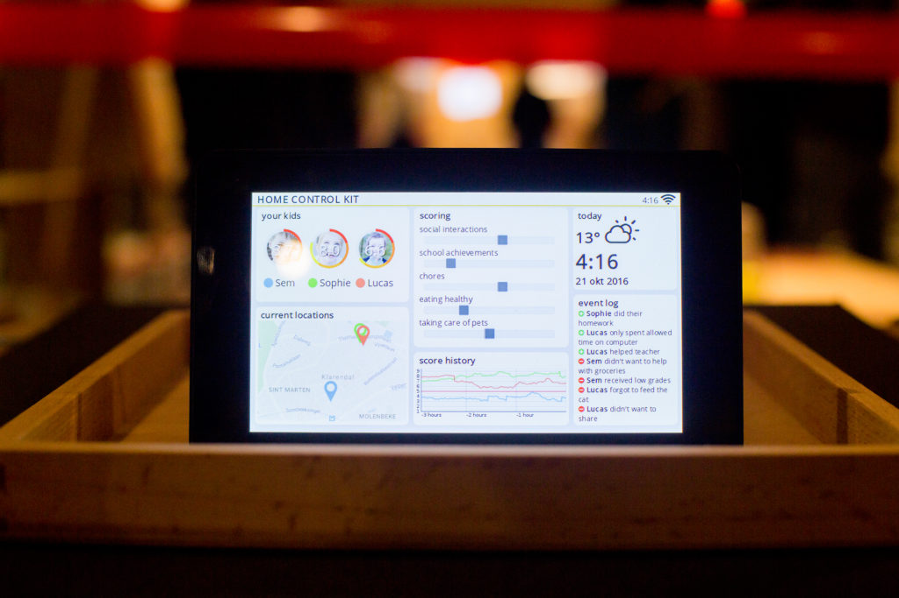

# Home Control Kit #

The Home Control Kit is a speculative installation showing how different
types of data can be used and interpreted by an algorithm to generate a
score for a child’s behavior.

More info can be found [here](https://jaspervanloenen.com/home-control-kit/)

The version currently in this repository is the Dutch version, made for a
regular display. I'll try to add the Raspberry Pi display version (which has
non-square pixels) and the original English version later.

Run the server with ```node controller/server.js```. By default the web
interface will be available on ```localhost:3000```.

The CSS files contain some instances of ```cursor: none;``` which you
might want to remove or change to ```cursor: inherit;``` when presenting on
device with a cursor (instead of on a tablet).


